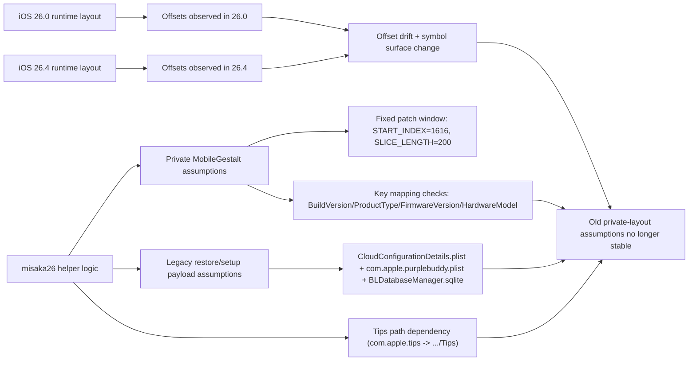

# Evidence Appendix (Read-Only, Inline Snippets)

This appendix inlines the exact keys, symbols, selectors/strings, and command outputs used by the study documents:

- `docs/misaka26-study.md`
- `docs/why-misaka26-does-not-work-on-ios26.4.md`

All evidence below is from static/read-only commands. No restore, patch execution, or device/system mutation is required.

## 1) Artifact Inventory (Exact Outputs)

### 1.1 Framework inventory

```text
misaka26.app/Contents/Frameworks/FlutterMacOS.framework
misaka26.app/Contents/Frameworks/App.framework
misaka26.app/Contents/Frameworks/path_provider_foundation.framework
misaka26.app/Contents/Frameworks/package_info_plus.framework
misaka26.app/Contents/Frameworks/shared_preferences_foundation.framework
misaka26.app/Contents/Frameworks/url_launcher_macos.framework
```

Command:

```sh
find misaka26.app/Contents -maxdepth 2 -type d -name '*.framework'
```

### 1.2 `sparserestore` helper payload inventory

```text
misaka26.app/Contents/Frameworks/App.framework/Resources/flutter_assets/sparserestore/BLDatabaseManager.sqlite
misaka26.app/Contents/Frameworks/App.framework/Resources/flutter_assets/sparserestore/CloudConfigurationDetails.plist
misaka26.app/Contents/Frameworks/App.framework/Resources/flutter_assets/sparserestore/Off.plist
misaka26.app/Contents/Frameworks/App.framework/Resources/flutter_assets/sparserestore/Off_patched.plist
misaka26.app/Contents/Frameworks/App.framework/Resources/flutter_assets/sparserestore/On.plist
misaka26.app/Contents/Frameworks/App.framework/Resources/flutter_assets/sparserestore/_.py
misaka26.app/Contents/Frameworks/App.framework/Resources/flutter_assets/sparserestore/com.apple.MobileGestalt.plist
misaka26.app/Contents/Frameworks/App.framework/Resources/flutter_assets/sparserestore/com.apple.purplebuddy.plist
misaka26.app/Contents/Frameworks/App.framework/Resources/flutter_assets/sparserestore/gestalt_restore.py
misaka26.app/Contents/Frameworks/App.framework/Resources/flutter_assets/sparserestore/get_apps.py
misaka26.app/Contents/Frameworks/App.framework/Resources/flutter_assets/sparserestore/install_trollstore.py
misaka26.app/Contents/Frameworks/App.framework/Resources/flutter_assets/sparserestore/json_restore.py
misaka26.app/Contents/Frameworks/App.framework/Resources/flutter_assets/sparserestore/reboot.py
misaka26.app/Contents/Frameworks/App.framework/Resources/flutter_assets/sparserestore/trollpad_patcher.m
misaka26.app/Contents/Frameworks/App.framework/Resources/flutter_assets/sparserestore/trollpad_patcher.py
```

Command:

```sh
find misaka26.app/Contents/Frameworks/App.framework/Resources/flutter_assets/sparserestore -maxdepth 1 -type f | sort
```

### 1.3 Prebuilt binaries + templates inventory

```text
misaka26.app/Contents/Resources/sparserestore/dist/arm64/misaka26-gestalt_restore
misaka26.app/Contents/Resources/sparserestore/dist/arm64/misaka26-get_apps
misaka26.app/Contents/Resources/sparserestore/dist/arm64/misaka26-install_trollstore
misaka26.app/Contents/Resources/sparserestore/dist/arm64/misaka26-json_restore
misaka26.app/Contents/Resources/sparserestore/dist/arm64/misaka26-reboot
misaka26.app/Contents/Resources/sparserestore/dist/arm64/misaka26-trollpad_patcher
misaka26.app/Contents/Resources/sparserestore/dist/x86_64/misaka26-gestalt_restore
misaka26.app/Contents/Resources/sparserestore/dist/x86_64/misaka26-get_apps
misaka26.app/Contents/Resources/sparserestore/dist/x86_64/misaka26-install_trollstore
misaka26.app/Contents/Resources/sparserestore/dist/x86_64/misaka26-json_restore
misaka26.app/Contents/Resources/sparserestore/dist/x86_64/misaka26-reboot
misaka26.app/Contents/Resources/sparserestore/dist/x86_64/misaka26-trollpad_patcher
misaka26.app/Contents/Resources/sparserestore/templates/Global_Default.plist
misaka26.app/Contents/Resources/sparserestore/templates/blank.plist
misaka26.app/Contents/Resources/sparserestore/templates/eligibility.plist
misaka26.app/Contents/Resources/sparserestore/templates/write.json
```

Command:

```sh
find misaka26.app/Contents/Resources/sparserestore -maxdepth 3 -type f | sort
```

## 2) Bundle Metadata, Signing, Linking

### 2.1 `Info.plist` evidence (line-numbered)

Source: `misaka26.app/Contents/Info.plist`

```xml
15		<key>CFBundleIdentifier</key>
16		<string>com.example.misaka26</string>
23		<key>CFBundleShortVersionString</key>
24		<string>26.1.6</string>
25		<key>CFBundleSupportedPlatforms</key>
26		<array>
27			<string>MacOSX</string>
28		</array>
37		<key>DTPlatformVersion</key>
38		<string>26.0</string>
41		<key>DTSDKName</key>
42		<string>macosx26.0</string>
43		<key>DTXcode</key>
44		<string>2601</string>
45		<key>DTXcodeBuild</key>
46		<string>17A400</string>
53		<key>NSPrincipalClass</key>
54		<string>NSApplication</string>
```

Command:

```sh
nl -ba misaka26.app/Contents/Info.plist
```

### 2.2 Entitlements evidence

```text
CodeDirectory ... flags=0x2(adhoc) ...
TeamIdentifier=not set
...
<key>com.apple.security.app-sandbox</key><false/>
<key>com.apple.security.cs.allow-jit</key><true/>
<key>com.apple.security.get-task-allow</key><true/>
<key>com.apple.security.network.server</key><true/>
```

Command:

```sh
codesign -dv --entitlements :- misaka26.app 2>&1
```

### 2.3 Main and framework symbol surface

Main executable exports:

```text
__mh_execute_header
_main
```

App framework exports:

```text
_kDartIsolateSnapshotData
_kDartIsolateSnapshotInstructions
_kDartVmSnapshotData
_kDartVmSnapshotInstructions
```

Commands:

```sh
nm -gjU misaka26.app/Contents/MacOS/misaka26
nm -gjU misaka26.app/Contents/Frameworks/App.framework/App
```

### 2.4 App framework strings (selector/string-level behavioral clues)

```text
You might be using com.apple.MobileGestalt.plist of another device.
package:misaka26/trollstore.dartr
/var/containers/Shared/SystemGroup/systemgroup.com.apple.mobilegestaltcache/Library/Caches/com.apple.MobileGestalt.plist
Please use the Shortcuts app on your device to extract the com.apple.MobileGestalt.plist file.
Remember to turn Find My back on!
Find My must be disabled in order to use this tool.
/var/db/eligibilityd/eligibility.plist
/sparserestore/templates/eligibility.plist
simulateTap
SpringBoard
```

Command:

```sh
strings -a misaka26.app/Contents/Frameworks/App.framework/App \
  | rg "MobileGestalt|trollstore|eligibility|SpringBoard|simulateTap|Find My"
```

## 3) Inline Helper Code Evidence (Original Snippets)

### 3.1 `_.py`: MobileGestalt restore target + key mapping

Source: `misaka26.app/Contents/Frameworks/App.framework/Resources/flutter_assets/sparserestore/_.py` lines 40-69

```python
40	    if from_path != "Reset" and to_path == "/var/containers/Shared/SystemGroup/systemgroup.com.apple.mobilegestaltcache/Library/Caches/com.apple.MobileGestalt.plist":
41	        handle_special_plist(from_path, lockdown)
...
52	    key_mapping = {
53	        "mZfUC7qo4pURNhyMHZ62RQ": "BuildVersion",
54	        "h9jDsbgj7xIVeIQ8S3/X3Q": "ProductType",
55	        "qNNddlUK+B/YlooNoymwgA": "ProductVersion",
56	        "LeSRsiLoJCMhjn6nd6GWbQ": "FirmwareVersion"
57	    }
...
67	            if plist_value != all_value:
68	                print("You might be using com.apple.MobileGestalt.plist of another device.")
69	                sys.exit(1)
```

### 3.2 `json_restore.py`: alternate key mapping with `HardwareModel`

Source: `misaka26.app/Contents/Frameworks/App.framework/Resources/flutter_assets/sparserestore/json_restore.py` lines 27-59

```python
27	        if os.path.getsize(mapping['from']) != 3 and mapping['to'] == "/var/containers/Shared/SystemGroup/systemgroup.com.apple.mobilegestaltcache/Library/Caches/com.apple.MobileGestalt.plist":
28	            handle_special_plist(mapping['from'], lockdown)
...
43	    key_mapping = {
44	        "mZfUC7qo4pURNhyMHZ62RQ": "BuildVersion",
45	        "/YYygAofPDbhrwToVsXdeA": "HardwareModel",
46	        "LeSRsiLoJCMhjn6nd6GWbQ": "FirmwareVersion"
47	    }
...
57	            if plist_value != all_value:
58	                print("You might be using com.apple.MobileGestalt.plist of another device.")
59	                sys.exit(1)
```

### 3.3 `trollpad_patcher.py`: fixed window + regex + byte-edit offset derivation

Source: `misaka26.app/Contents/Frameworks/App.framework/Resources/flutter_assets/sparserestore/trollpad_patcher.py` lines 5-47

```python
5	START_INDEX = 1616
6	SLICE_LENGTH = 200
...
24	    sliced_hex = hex_string[START_INDEX : START_INDEX + SLICE_LENGTH]
...
26	    pattern = re.compile(r"0+(?:5555)*([0-9A-F]{4})")
...
34	            absolute_offset = START_INDEX + slice_offset
...
45	    right_value = hex_string[right_offset]
46	    if right_value not in ("1", "3"):
47	        error("right value must be 1 or 3")
```

### 3.4 `trollpad_patcher.m`: explicit `DeviceClassNumber` key and values

Source: `misaka26.app/Contents/Frameworks/App.framework/Resources/flutter_assets/sparserestore/trollpad_patcher.m` lines 66-79

```objc
66	    // DeviceClassNumber key: mtrAoWJ3gsq+I90ZnQ0vQw
67	    off_t offset = find_offset("mtrAoWJ3gsq+I90ZnQ0vQw");
...
70	        // DeviceClassNumber values:
71	        // 1 = iPhone
72	        // 3 = iPad
73	        if (enableIPad) {
74	            buffer[offset] = 0x03; // Set to iPad
...
77	            buffer[offset] = 0x01; // Set to iPhone
```

### 3.5 `gestalt_restore.py`: restore domains and written files

Source: `misaka26.app/Contents/Frameworks/App.framework/Resources/flutter_assets/sparserestore/gestalt_restore.py` lines 69-139

```python
69	    e_file = get_base_path() + "/BLDatabaseManager.sqlite"
72	    config_file = get_base_path() + "/CloudConfigurationDetails.plist"
75	    purplebuddy_file = get_base_path() + "/com.apple.purplebuddy.plist"
...
81	            backup.Directory("", "SysSharedContainerDomain-systemgroup.com.apple.media.shared.books"),
...
104	                "SysSharedContainerDomain-systemgroup.com.apple.configurationprofiles",
...
121	                "Library/ConfigurationProfiles/CloudConfigurationDetails.plist",
122	                "SysSharedContainerDomain-systemgroup.com.apple.configurationprofiles",
...
129	                "ManagedPreferencesDomain",
...
134	                path="mobile/com.apple.purplebuddy.plist",
135	                domain="ManagedPreferencesDomain",
```

### 3.6 `install_trollstore.py`: Tips app dependency and target path calculation

Source: `misaka26.app/Contents/Frameworks/App.framework/Resources/flutter_assets/sparserestore/install_trollstore.py` lines 19-22 and 55-63

```python
19	def get_tips_app_path(lockdown):
20	    apps_json = InstallationProxyService(lockdown).get_apps(application_type="System", calculate_sizes=False)
21	    return apps_json.get("com.apple.tips", {}).get("Path", "")
...
55	        tips_path = get_tips_app_path(lockdown)
...
61	        to_path = f"{tips_path.replace('/private', '')}/Tips"
63	        restore_tips_app(from_path, to_path, lockdown)
```

## 4) Inline Payload/Template Evidence

### 4.1 `com.apple.MobileGestalt.plist` selected keys

```text
"/YYygAofPDbhrwToVsXdeA" => "J522AP"
"0+nc/Udy4WNG8S+Q7a/s1A" => "iPad13,8"
"5pYKlGnYYBzGvAlIU8RjEQ" => "t8103"
"mZfUC7qo4pURNhyMHZ62RQ" => "22B5034e"
"CacheVersion" => "22B5034e"
```

Command:

```sh
plutil -p misaka26.app/Contents/Frameworks/App.framework/Resources/flutter_assets/sparserestore/com.apple.MobileGestalt.plist \
  | rg "CacheVersion|mZfUC7qo4pURNhyMHZ62RQ|/YYygAofPDbhrwToVsXdeA|0\\+nc/Udy4WNG8S\\+Q7a/s1A|5pYKlGnYYBzGvAlIU8RjEQ"
```

### 4.2 `Off.plist` vs `On.plist` byte-level diff evidence

```text
Off.plist 6210
On.plist 6210
Off_patched.plist 6210
off_vs_on_diff_count 1
off_vs_on_first10 [816]
first_diff 816 1 3 3
offpatched_matches_on True
```

Command:

```sh
python3 - <<'PY'
import plistlib
from pathlib import Path
base=Path('misaka26.app/Contents/Frameworks/App.framework/Resources/flutter_assets/sparserestore')
for name in ('Off.plist','On.plist','Off_patched.plist'):
    with open(base/name,'rb') as f:
        p=plistlib.load(f)
    print(name, len(p['CacheData']))
off=plistlib.load(open(base/'Off.plist','rb'))['CacheData']
on=plistlib.load(open(base/'On.plist','rb'))['CacheData']
op=plistlib.load(open(base/'Off_patched.plist','rb'))['CacheData']
idx=[i for i,(a,b) in enumerate(zip(off,on)) if a!=b]
print('off_vs_on_diff_count', len(idx))
print('off_vs_on_first10', idx[:10])
if idx:
    i=idx[0]
    print('first_diff', i, off[i], on[i], op[i])
print('offpatched_matches_on', op==on)
PY
```

### 4.3 `CloudConfigurationDetails.plist` keys

Source: `misaka26.app/Contents/Frameworks/App.framework/Resources/flutter_assets/sparserestore/CloudConfigurationDetails.plist`

```xml
5	    <key>SkipSetup</key>
...
9	        <string>Restore</string>
12	        <string>AppleID</string>
19	        <string>Passcode</string>
20	        <string>Biometric</string>
39	        <string>AppStore</string>
47	        <string>RestoreCompleted</string>
48	        <string>UpdateCompleted</string>
...
51	    <key>AllowPairing</key>
52	    <true/>
54	    <key>ConfigurationWasApplied</key>
55	    <true/>
57	    <key>CloudConfigurationUIComplete</key>
58	    <true/>
63	    <key>PostSetupProfileWasInstalled</key>
64	    <true/>
66	    <key>IsSupervised</key>
67	    <false/>
```

### 4.4 `com.apple.purplebuddy.plist` keys

Source: `misaka26.app/Contents/Frameworks/App.framework/Resources/flutter_assets/sparserestore/com.apple.purplebuddy.plist`

```xml
5		<key>SetupDone</key>
6		<true/>
7		<key>SetupFinishedAllSteps</key>
8		<true/>
9		<key>UserChoseLanguage</key>
10		<true/>
```

### 4.5 `eligibility.plist` template keys

Source: `misaka26.app/Contents/Resources/sparserestore/templates/eligibility.plist`

```xml
5	    <key>OS_ELIGIBILITY_DOMAIN_CALCIUM</key>
9	        <key>os_eligibility_answer_t</key>
10	        <integer>2</integer>
19	    <key>OS_ELIGIBILITY_DOMAIN_GREYMATTER</key>
25	        <key>os_eligibility_answer_t</key>
26	        <integer>4</integer>
31	            <key>OS_ELIGIBILITY_INPUT_DEVICE_LANGUAGE</key>
33	            <key>OS_ELIGIBILITY_INPUT_DEVICE_LOCALE</key>
35	            <key>OS_ELIGIBILITY_INPUT_DEVICE_REGION_CODE</key>
37	            <key>OS_ELIGIBILITY_INPUT_GENERATIVE_MODEL_SYSTEM</key>
```

### 4.6 `write.json` target mapping

Source: `misaka26.app/Contents/Resources/sparserestore/templates/write.json`

```json
1	[
2	  {
3	    "from": "/Users/mini/Documents/misaka26/sparserestore/tmp/com.apple.MobileGestalt.plist",
4	    "to": "/var/containers/Shared/SystemGroup/systemgroup.com.apple.mobilegestaltcache/Library/Caches/com.apple.MobileGestalt.plist"
5	  }
6	]
```

### 4.7 `BLDatabaseManager.sqlite` table inventory

```text
ZBLDOWNLOADINFO        Z_METADATA             Z_PRIMARYKEY
ZBLDOWNLOADPOLICYINFO  Z_MODELCACHE
```

Command:

```sh
sqlite3 misaka26.app/Contents/Frameworks/App.framework/Resources/flutter_assets/sparserestore/BLDatabaseManager.sqlite '.tables'
```

## 5) iOS 26.0 vs 26.4 Runtime Evidence

### 5.1 Toolchain/runtime context

```text
Xcode 26.4
Build version 17E192
```

```text
iOS 26.0 (26.0 - 23A343) - com.apple.CoreSimulator.SimRuntime.iOS-26-0
iOS 26.4 (26.4 - 23E244) - com.apple.CoreSimulator.SimRuntime.iOS-26-4
```

Commands:

```sh
xcodebuild -version
xcrun simctl list runtimes | rg 'iOS 26\.(0|4)'
```

### 5.2 `libMobileGestalt.dylib` size delta

```text
939984 .../iOS 26.0.simruntime/.../libMobileGestalt.dylib
973792 .../iOS 26.4.simruntime/.../libMobileGestalt.dylib
```

Command:

```sh
wc -c \
  "/Library/Developer/CoreSimulator/Volumes/iOS_23A343/Library/Developer/CoreSimulator/Profiles/Runtimes/iOS 26.0.simruntime/Contents/Resources/RuntimeRoot/usr/lib/libMobileGestalt.dylib" \
  "/Library/Developer/CoreSimulator/Volumes/iOS_23E244/Library/Developer/CoreSimulator/Profiles/Runtimes/iOS 26.4.simruntime/Contents/Resources/RuntimeRoot/usr/lib/libMobileGestalt.dylib"
```

### 5.3 String-offset delta for key markers

26.0:

```text
222757 mZfUC7qo4pURNhyMHZ62RQ
229300 mtrAoWJ3gsq+I90ZnQ0vQw
230910 /YYygAofPDbhrwToVsXdeA
249971 BuildVersion
250714 DeviceClassNumber
```

26.4:

```text
224099 mZfUC7qo4pURNhyMHZ62RQ
224895 mtrAoWJ3gsq+I90ZnQ0vQw
227913 /YYygAofPDbhrwToVsXdeA
248190 BuildVersion
248954 DeviceClassNumber
```

Commands:

```sh
strings -a -t d "<26.0 libMobileGestalt>" \
  | rg "mZfUC7qo4pURNhyMHZ62RQ|mtrAoWJ3gsq\+I90ZnQ0vQw|/YYygAofPDbhrwToVsXdeA|BuildVersion|DeviceClassNumber"

strings -a -t d "<26.4 libMobileGestalt>" \
  | rg "mZfUC7qo4pURNhyMHZ62RQ|mtrAoWJ3gsq\+I90ZnQ0vQw|/YYygAofPDbhrwToVsXdeA|BuildVersion|DeviceClassNumber"
```

### 5.4 Exported symbol delta (MobileGestalt subset)

```text
Only in 26.0 (MobileGestalt):

Only in 26.4 (MobileGestalt):
_MobileGestalt_copy_regionInfoFromActivation
_MobileGestalt_copy_regionInfoFromActivation_obj
_MobileGestalt_copy_regionInfoFromSysconfig
_MobileGestalt_copy_regionInfoFromSysconfig_obj
_MobileGestalt_copy_regionalBehaviorsFromActivation
_MobileGestalt_copy_regionalBehaviorsFromActivation_obj
_MobileGestalt_get_allowPhoneApp
_MobileGestalt_get_audioExclaveMicInputCapability
_MobileGestalt_get_dataCenterRegionCode
_MobileGestalt_get_deviceSupportsDarwinInitConfigFromNVRAM
_MobileGestalt_get_deviceSupportsHandwritingSynthesisModel
_MobileGestalt_get_fanCount
_MobileGestalt_get_oSMigrationCapability
_MobileGestalt_get_uSBPortCount
```

Command:

```sh
TMP=$(mktemp -d)
nm -gjU "<26.0 libMobileGestalt>" | sort > "$TMP/old.syms"
nm -gjU "<26.4 libMobileGestalt>" | sort > "$TMP/new.syms"
comm -23 "$TMP/old.syms" "$TMP/new.syms" | rg '^_MobileGestalt'
comm -13 "$TMP/old.syms" "$TMP/new.syms" | rg '^_MobileGestalt'
rm -rf "$TMP"
```

## 6) Why It Breaks (Evidence Graph)



## 7) Reproducible Read-Only Validation Commands

```sh
./scripts/read_only_compat_check.sh --output reports/read_only_compat_report_latest.md
./scripts/generate_full_evidence_pack.sh --out-dir evidence/full_pack_latest
```

These scripts already collect and preserve the same evidence classes shown above:

- static source and metadata extraction
- symbols and string offsets
- plist/sqlite read-only inspection
- runtime 26.0 vs 26.4 comparison artifacts
